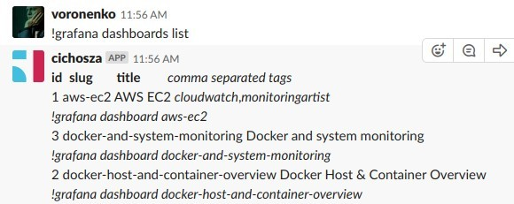
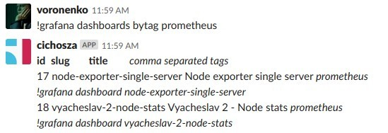
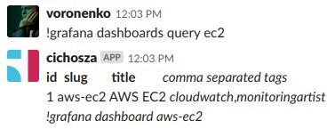
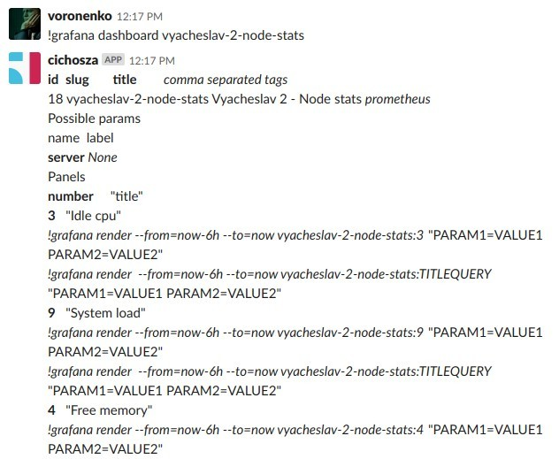
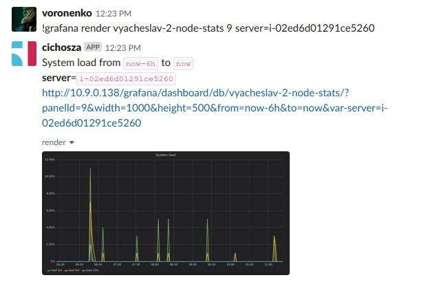
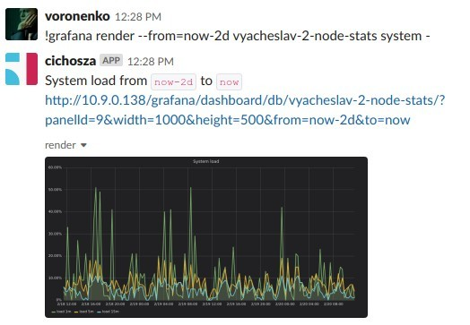

Grafana plugin for Errbot
=========================

Member of `sa-cichosza` family

Chatops features for Grafana
----------------------------

This plugin allows you to refer grafana dashboards and panels for your team in a Slack channel.
`More information about Errbot <http://errbot.io>`_.

Quickstart
----------

First you need to install Errbot, you can `follow this documentation <http://errbot.io/en/latest/user_guide/setup.html>`_.
Errbot server can be installed with https://github.com/softasap/sa-chatops-errbot ansible role or manually

Then you'll need to install this plugin on your Errbot instance doing 
```
!repos install https://github.com/Voronenko/errbot-grafana
```
, you can do that by talking to your bot locally with `errbot -T`. 

Initially, you need also to let bot know how to connect to your grafana instance, providing grafana address and access token.

```
!plugin config SaGrafana {'server_address': 'http://10.9.0.138/grafana', 'token': 'eyJrIjoicmNveFpac0tBZm81YzFrMDRNdWVQelRaN3VEOG5tblMiLCJuIjoiZS1ncmFmYW5hIiwiaWQiOjF9'}
```

Once everything is setup, you can connect your bot to your Slack channel following `this documentation <http://errbot.io/en/latest/user_guide/configuration/slack.html>`_.


Bot commands
------------

### Dashboard global listing  `!grafana dashboards list`



Note, that you get immediate hint on getting more info about dashboard 
with `!grafana dashboard <slug>` command

### Filtering dashboard listing by tag  `!grafana dashboards bytag`



Get only tagged dashboards with `!grafana dashboards query <text>`
command

### Fuzzy finding of the dashboard by fragment `!grafana dashboards query`



Return filtered dashboard list by fragment in title
with `!grafana dashboard query <text>` command

### Getting dashboard details `!grafana dashboard <slug>`

Helps you to discover dashboard and find out possible input parameters and existing panels with command `!grafana dashboard <slug>`



Take a note on panel id or some unique word in panel title. You will need it to render specific panel.


### Render specific panel with parameters `!grafana render <slug> <panel> <parameters>`



You can use change timespan by providing optional `--from`  and `--to` parameters: `!grafana render --from=now-2d vyacheslav-2-node-stats 9 server=i-02ed6d01291ce5260`

You can replace panelid with some unique text from panel title, for example, `system`

`!grafana render vyacheslav-2-node-stats system server=i-02ed6d01291ce5260`

If your panel supports default parameters, you can skip parameters with dash:  `!grafana render --from=now-2d vyacheslav-2-node-stats system`




### Ping `!grafana status`

This command, `!grafana status`, if succeeded returns some debug info about plugin.
Use it to ensure that plugin is actually alive.

Contributing
------------

Contributions to this plugin are always welcome and highly encouraged.

License
-------

MIT - See `LICENSE <LICENSE>`_ for more information.


Interested in other plugins or roles ?
--------------------------------------

Subscribe for roles updates at [FB] (https://www.facebook.com/SoftAsap/)

Join gitter discussion channel at [Gitter](https://gitter.im/softasap)

Discover other roles at  http://www.softasap.com/roles/registry_generated.html

